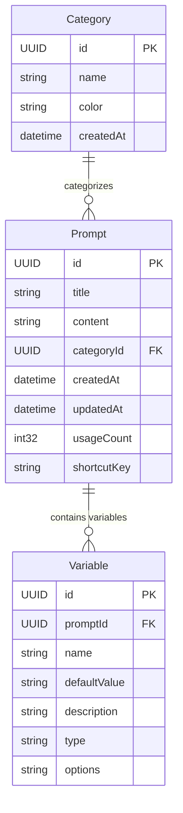

# プロンプト管理システム ER図

## 概要
PromptVaultアプリケーションのCore Dataモデル設計図です。
Phase1（MVP）とPhase2（機能強化）の要件を考慮した設計となっています。

## ER図

## エンティティ詳細

### Category（カテゴリ）
プロンプトの分類を管理するエンティティです。

| 属性名 | 型 | 制約 | 説明 |
|--------|-----|------|------|
| id | UUID | PK | 主キー |
| name | String | NOT NULL | カテゴリ名 |
| color | String | NULLABLE | カテゴリ色（Hex） |
| createdAt | Date | NOT NULL | 作成日時 |

**特徴**
- フラットな構造でシンプルなカテゴリ管理
- カテゴリ数が少ない想定
- デフォルトカテゴリ：「コード生成」「デバッグ」「説明」「レビュー」

### Prompt（プロンプト）
メインのプロンプトデータを管理するエンティティです。

| 属性名 | 型 | 制約 | 説明 |
|--------|-----|------|------|
| id | UUID | PK | 主キー |
| title | String | NOT NULL | プロンプトタイトル |
| content | String | NOT NULL | プロンプト内容 |
| categoryId | UUID | FK, NOT NULL | 所属カテゴリID |
| createdAt | Date | NOT NULL | 作成日時 |
| updatedAt | Date | NOT NULL | 更新日時 |
| usageCount | Int32 | NOT NULL, DEFAULT 0 | 使用回数 |
| shortcutKey | String | NULLABLE, UNIQUE | ショートカットキー（例：cmd+shift+1） |

**特徴**
- 使用統計情報を内包（usageCount）
- カテゴリによる分類管理
- 個別ショートカットキーによる直接アクセス
- Phase2の変数システムに対応（${variable_name}形式）

### Variable（変数）- Phase2実装
プロンプトテンプレートの変数を管理するエンティティです。

| 属性名 | 型 | 制約 | 説明 |
|--------|-----|------|------|
| id | UUID | PK | 主キー |
| promptId | UUID | FK, NOT NULL | 所属プロンプトID |
| name | String | NOT NULL | 変数名（例：project_name） |
| defaultValue | String | NULLABLE | デフォルト値 |
| description | String | NULLABLE | 変数の説明 |
| type | String | NOT NULL | 変数型（text, choice, date等） |
| options | String | NULLABLE | 選択肢（choice型の場合） |

**特徴**
- 動的な値置換システム
- 複数の変数型をサポート
- 使いやすいデフォルト値設定

## 関係性

### 1対多関係
- **Category ← Prompt**: 1つのカテゴリは複数のプロンプトを持つ
- **Prompt ← Variable**: 1つのプロンプトは複数の変数を持つ（Phase2）

## インデックス設計

### パフォーマンス最適化用インデックス
- `Prompt.categoryId`: カテゴリ別検索
- `Prompt.usageCount`: 使用頻度順ソート
- `Prompt.shortcutKey`: ショートカットキー検索（UNIQUE制約）
- `Variable.promptId`: プロンプト別変数検索

## 実装フェーズ

### Phase1（MVP）
- ✅ Category エンティティ
- ✅ Prompt エンティティ
- 基本的なCRUD操作
- カテゴリ分類機能
- ショートカットキー機能

### Phase2（機能強化）
- ✅ Variable エンティティ
- 変数システム実装（${variable_name}形式）
- 使用統計の高度な分析

## データマイグレーション

Phase1からPhase2への移行時：
1. `Variable` エンティティを追加
2. 軽量マイグレーション実行
3. 既存プロンプトの変数検出機能を追加

## セキュリティ考慮事項

- プロンプト内容の暗号化（機密情報を含む場合）
- バックアップ時の安全な保存
- インポート/エクスポート時のデータ検証